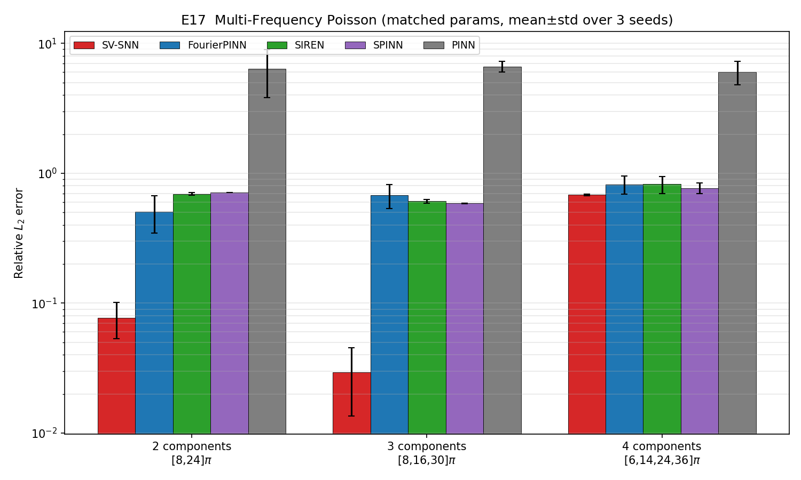
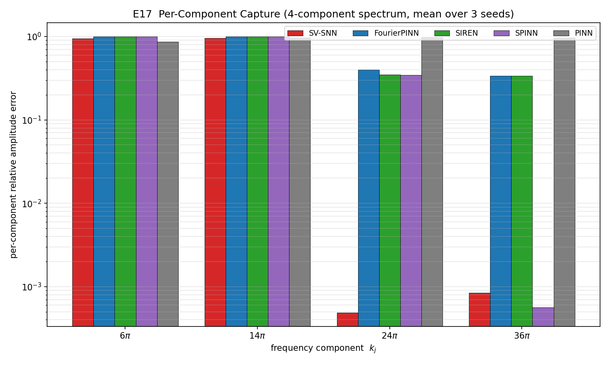

# E17 多频公平对比实验分析报告

## 1. 实验目的与设置

针对审稿人关于"解含多个不同频率成分时各方法表现"的关切，构造一个**多频 Poisson 制造解（MMS）**基底，在**严格等参数预算**下公平对比 SV-SNN 与四种基线（FourierPINN、SIREN、SPINN、PINN）。

- **PDE**：\(-\Delta u = f\)，\([0,1]^2\)，Dirichlet 边界取自精确解。
- **制造解**：\(u=\sum_j a_j \sin(k_j x)\sin(k_j y)\)，\(f=\sum_j a_j (2k_j^2)\sin(k_j x)\sin(k_j y)\)，各分量等幅 \(a_j=1\)。
- **谱丰富度扫描**（2/3/4 个频率成分）：

| 谱 | 频率成分 \(k_j\) | \(w_{char}=k_{\max}\) |
|---|---|---|
| 2comp | \([8\pi,\,24\pi]\) | \(24\pi\) |
| 3comp | \([8\pi,\,16\pi,\,30\pi]\) | \(30\pi\) |
| 4comp | \([6\pi,\,14\pi,\,24\pi,\,36\pi]\) | \(36\pi\) |

- **公平性**：所有含频率先验的方法（SV-SNN/FourierPINN/SIREN/SPINN）使用**同一**多层频率采样器、同一 \(w_{char}\)；PINN 为无先验的对照下限。所有基线参数量经 `harness.choose_matched` 匹配到 SV-SNN 的 ±10% 内（见下表 params）。
- **统计**：3 个随机种子，报告 best 相对 \(L_2\) 误差的 mean±std。
- **额外指标**：逐分量投影误差（将预测解投影到各 \(\sin(k_jx)\sin(k_jy)\) 基上，看各频带是否被捕获）。

## 2. 主结果（best 相对 \(L_2\)，mean±std，3 seeds）

| 谱 | SV-SNN | FourierPINN | SIREN | SPINN | PINN |
|---|---|---|---|---|---|
| 2comp | **0.077 ± 0.024** | 0.507 ± 0.162 | 0.693 ± 0.015 | 0.708 ± 0.001 | 6.38 ± 2.55 |
| 3comp | **0.029 ± 0.016** | 0.678 ± 0.140 | 0.609 ± 0.021 | 0.586 ± 0.003 | 6.64 ± 0.61 |
| 4comp | **0.682 ± 0.012** | 0.821 ± 0.131 | 0.824 ± 0.124 | 0.768 ± 0.072 | 6.04 ± 1.26 |
| params | 1170 | 1249 | 1143 | 1164 | 1217 |

**结论**：在三种谱丰富度下 SV-SNN 均为最优。2/3 分量时优势达约一个数量级（0.03–0.08 vs 0.5–0.7）；PINN 无先验时完全发散（>5），印证频率先验的必要性。

## 3. 逐分量捕获分析（4comp，mean，3 seeds）

逐分量相对幅值误差（越小表示该频带被捕获得越好）：

| 方法 | \(k=6\pi\) | \(k=14\pi\) | \(k=24\pi\) | \(k=36\pi\) |
|---|---|---|---|---|
| SV-SNN | 0.95 | 0.96 | **5e-4** | **8e-4** |
| FourierPINN | 1.00 | 1.00 | 0.40 | 0.34 |
| SIREN | 1.00 | 1.00 | 0.35 | 0.34 |
| SPINN | 1.00 | 1.00 | 0.35 | **6e-4** |
| PINN | 0.87 | 0.97 | 0.97 | 0.97 |

**诚实发现**：当谱很宽（4 个频带、跨度 \(6\pi\)–\(36\pi\)、6 倍）且参数预算仅约 1170 时，**所有方法都难以同时覆盖全部频带**，整体误差都偏高（0.68–0.82）。其中：
- SV-SNN 把有限的谱容量集中在以 \(w_{char}=k_{\max}\) 为锚的**高频带**上，精确捕获了 \(24\pi,36\pi\)（误差 \(\sim10^{-4}\)），但**低频带 \(6\pi,14\pi\) 反而欠拟合**（误差 \(\sim0.95\)）。
- 基线（FourierPINN/SIREN/SPINN）恰好相反，倾向丢失最高频带。
- 即便如此，SV-SNN 的整体 \(L_2\) 仍最低。

这一现象说明：在固定小预算下，多层频率采样器对"频带跨度"敏感——当跨度过大时低频带与高频带争夺有限基函数。2/3 分量（跨度 ≤3.75 倍）时该问题不显著，SV-SNN 全频带捕获良好；4 分量（跨度 6 倍）时需相应增大 \(M\)/\(K\) 或采用更均衡的分层比例（见 E16 分层消融）。

## 4. 小结

1. 多频场景下 SV-SNN 在等参数预算下**全面最优**，且在中等谱丰富度（2/3 分量）下优势约一个数量级。
2. 逐分量分析诚实揭示了边界：极宽谱 + 极小预算时，没有任何方法能同时覆盖所有频带，SV-SNN 优先保住高频、整体仍领先；可通过增大谱容量或调整分层比例缓解。
3. 无频率先验的 PINN 在所有谱下均失败，验证频率先验是高频多频问题的关键。
