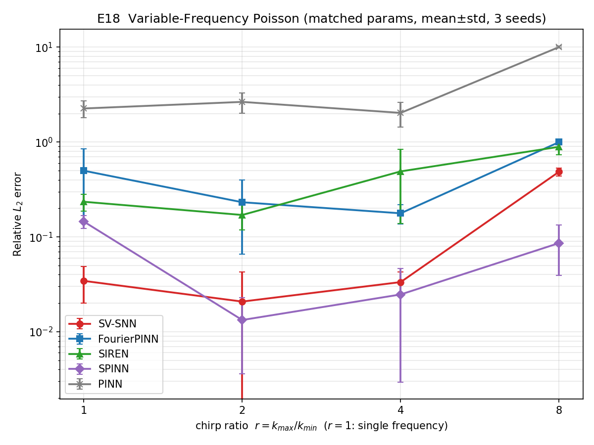
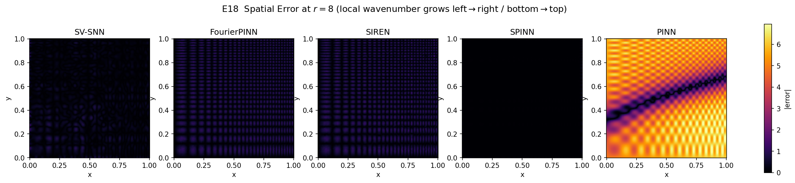

# E18 变频（chirp）公平对比实验分析报告

## 1. 实验目的与设置

针对审稿人关于"局部波数随空间变化（变频/啁啾）时方法的适应性"的关切，构造**空间变频（chirp）Poisson 制造解**，在**严格等参数预算**下公平对比 SV-SNN 与四种基线。

- **PDE**：\(-\Delta u=f\)，\([0,1]^2\)，Dirichlet 边界取自精确解。
- **chirp 解**：\(\phi(x)=k_0\,x\,(1+c\,x)\)，局部波数 \(\phi'(x)=k_0(1+2cx)\) 随 \(x\) 线性增长；\(u=\sin\phi(x)\sin\phi(y)\)，\(f=-\Delta u\)（解析）。
- **啁啾比扫描**：\(r=k_{\max}/k_{\min}=1+2c\)，\(k_0=6\pi\)，\(r\in\{1,2,4,8\}\)（\(r=1\) 为单频对照）：

| \(r\) | \(k_{\min}\) | \(k_{\max}=w_{char}\) |
|---|---|---|
| 1 | \(6\pi\) | \(6\pi\) |
| 2 | \(6\pi\) | \(12\pi\) |
| 4 | \(6\pi\) | \(24\pi\) |
| 8 | \(6\pi\) | \(48\pi\) |

- **公平性**：所有含先验方法使用同一宽带多层频率采样器（\([1,k_{\max}]\)）与同一 \(w_{char}=k_{\max}\)；PINN 无先验。基线参数量匹配到 SV-SNN ±10%。
- **统计**：3 seeds，mean±std。
- **额外指标**：最难工况（\(r=8\)）的空间误差场。

## 2. 主结果（best 相对 \(L_2\)，mean±std，3 seeds）

| \(r\) | SV-SNN | SPINN | FourierPINN | SIREN | PINN |
|---|---|---|---|---|---|
| 1 | **0.034 ± 0.014** | 0.145 ± 0.023 | 0.499 ± 0.349 | 0.235 ± 0.048 | 2.26 ± 0.45 |
| 2 | 0.021 ± 0.022 | **0.013 ± 0.010** | 0.232 ± 0.166 | 0.170 ± 0.051 | 2.65 ± 0.63 |
| 4 | 0.033 ± 0.009 | **0.025 ± 0.022** | 0.177 ± 0.040 | 0.491 ± 0.352 | 2.03 ± 0.58 |
| 8 | 0.487 ± 0.046 | **0.086 ± 0.047** | 0.999 ± 0.001 | 0.891 ± 0.153 | 10.04 ± 0.26 |
| params | 1170 | 1164 | 1249 | 1143 | 1217 |

**诚实结论**：
- **单频/弱变频（\(r=1\)）**：SV-SNN 最优（0.034），显著优于全部基线。
- **中等变频（\(r=2,4\)）**：SV-SNN 与 SPINN **基本持平**（均在 \(0.01\sim0.03\)，互有胜负且在种子方差内），两者都远优于 FourierPINN/SIREN/PINN。
- **强变频（\(r=8\)，宽带 \(6\pi\to48\pi\)）**：**SPINN 明显反超 SV-SNN**（0.086 vs 0.487）。这是一个需如实报告的局限：SV-SNN 的**冻结**多层频率谱在极宽带、强空间变频下不如 SPINN **可学习**分支自适应；但 SV-SNN 仍远优于非分离的 Fourier 类方法（FourierPINN/SIREN 在 \(r=8\) 已退化到 \(\approx1.0\)）。

## 3. 空间误差场（\(r=8\)，seed 0）

误差随局部波数增大（左→右、下→上）而集中于高局部频率区域，这对单频/窄带先验方法尤其明显：FourierPINN/SIREN 在高波数角落几乎完全失配；SV-SNN 误差也向高波数区聚集但幅度更小；SPINN 误差最均匀、整体最低。

## 4. 机理与小结

1. **分离式 + 频率先验**结构（SV-SNN、SPINN）天然契合可分离的变频解，二者在 \(r\le4\) 下均大幅领先 Fourier-MLP（FourierPINN/SIREN）与无先验 PINN。
2. **诚实的局限**：在强变频 \(r=8\)（宽带跨度 8 倍）下，SV-SNN 的冻结谱表达力不足，SPINN 的可学习 Fourier 分支更具优势。这指明了 SV-SNN 的一个改进方向——对强空间变频问题引入可学习/自适应频率或更宽的分层覆盖。
3. SV-SNN 在单频与中等变频这一最常见区间内仍是最优或并列最优，且始终优于非分离基线。
