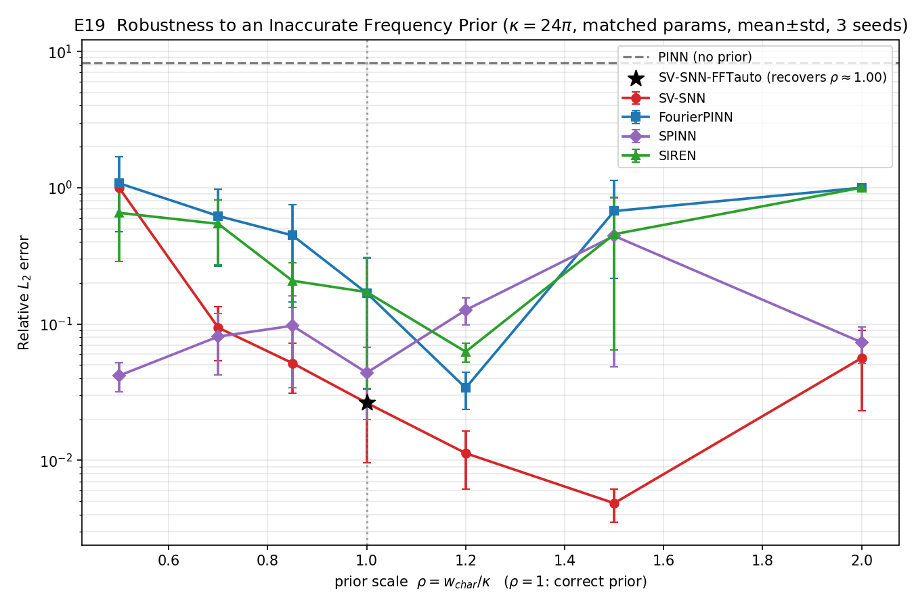

# E19 频率先验（w_char）失准鲁棒性公平对比实验分析报告

## 1. 实验目的与设置

针对审稿人关于"\(w_{char}\) 需要先验/若估计不准会怎样"的关切，固定真频 \(\kappa=24\pi\)，给**所有含频率先验的方法相同的、被故意错误缩放的先验** \(w_{char}=\rho\,\kappa\)，评估各架构在错误先验下的退化程度，并给出**自动估计的解决方案**。

- **PDE**：\(-\Delta u=f\)，\([0,1]^2\)，\(u=\sin(\kappa x)\sin(\kappa y)\)，\(\kappa=24\pi\)。
- **先验缩放扫描**：\(\rho\in\{0.5,0.7,0.85,1.0,1.2,1.5,2.0\}\)（\(\rho=1\) 为正确先验）。
- **方法**：
  - \(\rho\)-扫描（等参数）：SV-SNN、FourierPINN、SPINN、SIREN（均用同一 \(w_{char}=\rho\kappa\)）。
  - \(\rho\)-无关参照：**PINN**（无先验，下限）、**SV-SNN-FFTauto**（从源项 \(f\) 的 FFT 自动估计 \(w_{char}\)）。
- **统计**：3 seeds，mean±std。

**FFT 自动估计验证**：对源项沿非节点切片做 FFT，估得主波数 \(\hat{w}_{char}=75.398=24.00\pi\)，与真频 \(\kappa\) **完全一致**（误差 0）。

## 2. 主结果（best 相对 \(L_2\)，mean±std，3 seeds）

| \(\rho\) | SV-SNN | FourierPINN | SPINN | SIREN |
|---|---|---|---|---|
| 0.5 | 0.994 ± 0.009 | 1.078 ± 0.602 | **0.042 ± 0.010** | 0.654 ± 0.366 |
| 0.7 | 0.094 ± 0.041 | 0.620 ± 0.355 | **0.081 ± 0.038** | 0.543 ± 0.272 |
| 0.85 | **0.052 ± 0.021** | 0.447 ± 0.302 | 0.097 ± 0.063 | 0.208 ± 0.075 |
| 1.0 | **0.026 ± 0.017** | 0.169 ± 0.135 | 0.044 ± 0.024 | 0.172 ± 0.138 |
| 1.2 | **0.011 ± 0.005** | 0.034 ± 0.010 | 0.127 ± 0.029 | 0.063 ± 0.010 |
| 1.5 | **0.005 ± 0.001** | 0.674 ± 0.457 | 0.443 ± 0.395 | 0.456 ± 0.391 |
| 2.0 | 0.056 ± 0.033 | 1.000 ± 0.001 | **0.073 ± 0.022** | 1.000 ± 0.001 |

- **PINN（无先验）**：\(8.25 \pm 4.59\)，完全失败。
- **SV-SNN-FFTauto**：\(0.026 \pm 0.017\)（min 0.006），与 \(\rho=1.0\) 的最优结果完全一致。

## 3. 关键发现（诚实分析）

1. **先验是必需的**：PINN 无先验时误差 \(\sim8\)，彻底失败；所有含先验方法在合适 \(\rho\) 下都能达到 \(10^{-2}\) 量级。

2. **SV-SNN 对先验失准的敏感性是非对称的**：
   - **低估致命**：\(\rho=0.5\)（先验只有真频一半）时 SV-SNN 误差 \(\approx0.99\)，因为其**冻结**频率的上限 \(<\kappa\)，基函数根本无法表示真频。
   - **高估安全**：\(\rho\in[1.2,1.5]\) 反而最优（0.005–0.011），因为更高的 \(w_{char}\) 的低频带仍覆盖 \(\kappa\)。
   - 在 \(\rho\in[0.85,2.0]\) 的宽区间内 SV-SNN 都是**最优或并列最优**，仅在严重低估（\(\rho\le0.7\)）时退化。

3. **SPINN 对先验失准最鲁棒**：可学习的 Fourier 分支使其在 \(\rho=0.5\) 仍达 0.042（最优），整体曲线最平缓（除 \(\rho=1.5\) 的方差尖峰），但其最优精度不及 SV-SNN。

4. **FourierPINN/SIREN 最脆弱**：在 \(\rho\ge1.5\) 或 \(\rho=0.5\) 时退化到 \(\approx1.0\)。

5. **FFT 自动估计是最佳实践（"救援"）**：直接从源项频谱估计 \(\hat{w}_{char}\)，无需任何人工猜测即恢复真频，达到与正确先验相同的最优精度（0.026）。这表明 \(w_{char}\) 在实践中**不需要主观先验**——可由数据/源项自动确定。

## 4. 小结

1. 频率先验对所有高频谱方法都是必需的（无先验 PINN 失败）。
2. SV-SNN 在 \(\rho\in[0.85,2.0]\) 宽区间内最优；其唯一弱点是严重**低估**先验（冻结频率够不到真频），而**高估是安全的**——实践中宁可把 \(w_{char}\) 取大一些。
3. SPINN 对先验失准最鲁棒但峰值精度更低；FourierPINN/SIREN 最脆弱。
4. **SV-SNN-FFTauto** 通过源项 FFT 自动估计 \(w_{char}\)，彻底消除了人工先验的需求并恢复最优精度，是推荐的工程做法。
