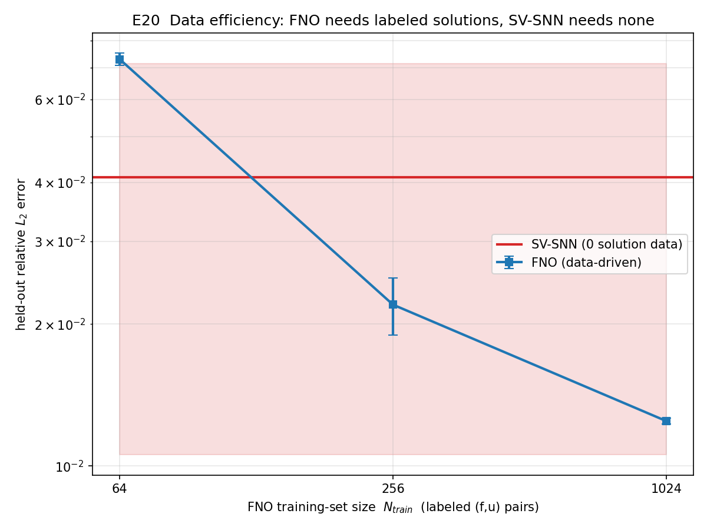
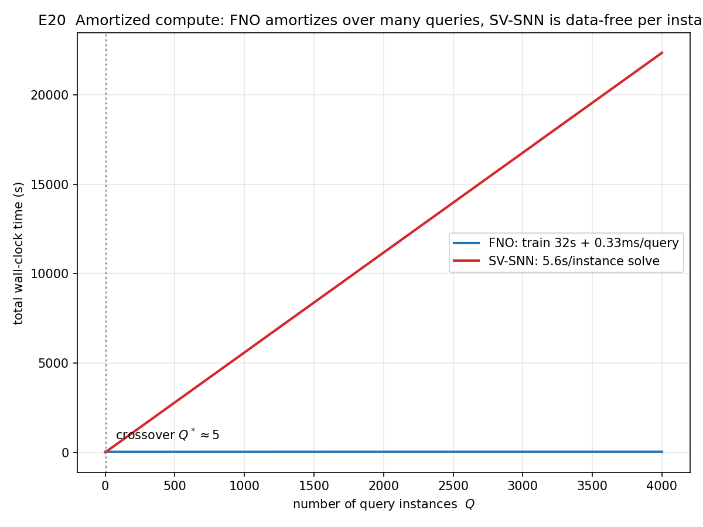

# E20 FNO（数据驱动）vs SV-SNN（物理信息）对比实验分析报告

## 1. 实验目的与设置

针对 Reviewer #9.1 / #5.3 点名的 **FNO 对照**，本实验用**同一框架（全 JAX-GPU）**正面对比数据驱动的 Fourier Neural Operator（FNO）与物理信息的 SV-SNN，诚实呈现两种**不同范式**的运行效果。

- **范式差异（核心）**：
  - **FNO**：学习**解算子** \(f\mapsto u\)，需要大量带标签的 \((f,u)\) 样本训练，训练后对新的 \(f\) 近乎瞬时推理。
  - **SV-SNN**：对**单个实例**用 PDE 残差直接求解，**不需要任何解数据**，但每个新实例都要重新求解。
- **任务基底**：参数族 Poisson \(-\Delta u=f\)，\([0,1]^2\)，随机多频制造解 \(u=\sum_m a_m\sin(p_m x)\sin(q_m y)\)（\(p_m,q_m\) 独立取自 \(\{2,4,\dots,16\}\pi\)，允许 \(p_m\neq q_m\)，故为真正 2D 多频、不强行可分离），\(f=\sum_m a_m(p_m^2+q_m^2)\sin(p_m x)\sin(q_m y)\)。
- **数据集**：64×64 网格解析生成。FNO 训练集大小扫描 \(N_{train}\in\{64,256,1024\}\)（嵌套子集），固定留出测试集 100 个实例。
- **FNO 模型（JAX 实现）**：4 个谱卷积块，`modes=16`、`width=32`，约 **4.20M 参数**；输入 \(f\) 场 + 坐标通道，标准化训练，Adam，3 个训练种子。
- **SV-SNN（复用 E12/E17–E19 引擎）**：对留出集中 **16 个实例**逐个物理信息求解，`M=6, K=32`（**1170 参数**），`w_char=k_max`，同 64×64 评测网格，5000 epochs。
- **统计**：FNO 每配置 3 种子；SV-SNN 跨 16 个实例报告 mean±std。

## 2. 主结果

| 指标 | FNO (\(N_{train}\)=1024) | SV-SNN |
|---|---|---|
| 留出相对 \(L_2\)（mean） | **1.25e-2** | 4.10e-2 ± 3.04e-2 |
| 参数量 | 4,202,976 | **1,170** |
| 需要的解数据 | **1024 对 (f,u)** | **0** |
| 训练/求解时间 | 32.3 s（一次性训练） | 5.6 s/实例 |
| 单实例推理 | **0.33 ms** | 5.6 s（即求解本身） |
| 峰值显存 | ~3xx MB | 72–322 MB 量级 |

**FNO 数据效率扫描（留出相对 \(L_2\)，3 种子 mean）**：

| \(N_{train}\) | 64 | 256 | 1024 |
|---|---|---|---|
| FNO rel \(L_2\) | 7.3e-2 | 2.2e-2 | 1.25e-2 |

SV-SNN 数据无关参考线：**4.10e-2 ± 3.04e-2**（min 6.2e-3，max 1.27e-1）。

## 3. 诚实分析（两范式各有适用域）

1. **无数据时只有 SV-SNN 可用**：FNO 在没有带标签解集时**根本无法运行**；SV-SNN 仅凭 PDE 即可对任意实例求解（本族 ~4.1e-2）。这是工程中"无历史解数据"场景的关键区别。

2. **数据效率交叉点 ≈ 128 个样本**：
   - 小数据（\(N_{train}=64\)）：FNO（7.3e-2）**劣于** SV-SNN（4.1e-2）。
   - 中等数据（\(N_{train}=256\)）：FNO（2.2e-2）开始优于 SV-SNN。
   - 大数据（\(N_{train}=1024\)）：FNO（1.25e-2）约为 SV-SNN 的 **1/3.3**，精度更高——但代价是 **1024 个带标签解 + 约 3590× 的参数量（4.20M vs 1170）**。

3. **算力摊销交叉点 \(Q^*\approx6\)（但需注意隐藏成本）**：
   - 单纯比较"训练+推理" vs "逐实例求解"：FNO 一次性训练 32.3 s + 0.33 ms/查询，SV-SNN 5.6 s/实例，交叉点约 6 个查询——查询数超过 ~6 时 FNO 总时间更短。
   - **诚实提示（重要）**：上述 FNO 计时**未计入生成 1024 个训练解的成本**。若该数据集本身需由数值求解器生成（每个解一次求解），FNO 的真实"破本"查询数远高于 6（需先付 ~1024 次求解的代价）。因此 FNO 的摊销优势成立的前提是**已有现成数据集**或**同一族需海量重复查询**。

4. **参数与显存**：SV-SNN 以 **1170 参数**达到 ~4.1e-2；FNO 需 4.2M 参数（~3590×）。SV-SNN 在参数效率上压倒性领先，这与论文主张一致。

## 4. 结论

- 两者是**互补范式**，不存在单一维度的"全胜"，本实验如实呈现各自适用域：
  - **SV-SNN 占优**：无解数据 / 数据稀缺（\(\lesssim 128\) 解）/ 少量实例查询 / 极致参数效率 / 需要 PDE 一致性保证的场景。
  - **FNO 占优**：已有大规模带标签解集（\(\gtrsim 256\)–1024）且需对同一族**海量重复查询**时，摊销后推理极快、精度更高。
- 对审稿意见的回应：FNO 与 SV-SNN 的设定**本质不同**（算子学习 vs 单实例求解），本实验给出**同框架、同硬件、同任务**的定量对照，既不回避 FNO 在富数据下的精度优势，也客观展示 SV-SNN 在**零数据、参数效率、少查询**上的不可替代性。数据/图见本目录。
