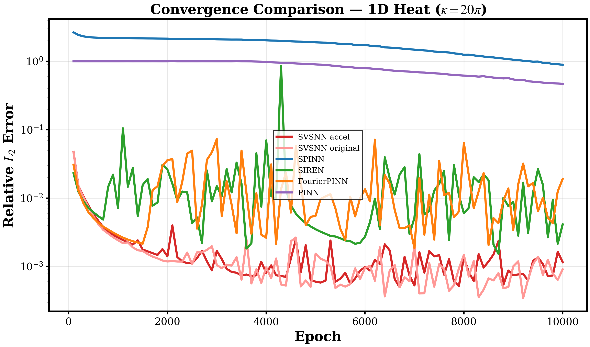
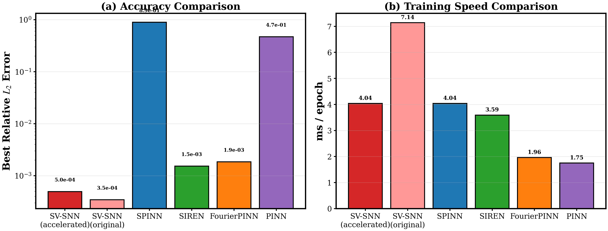
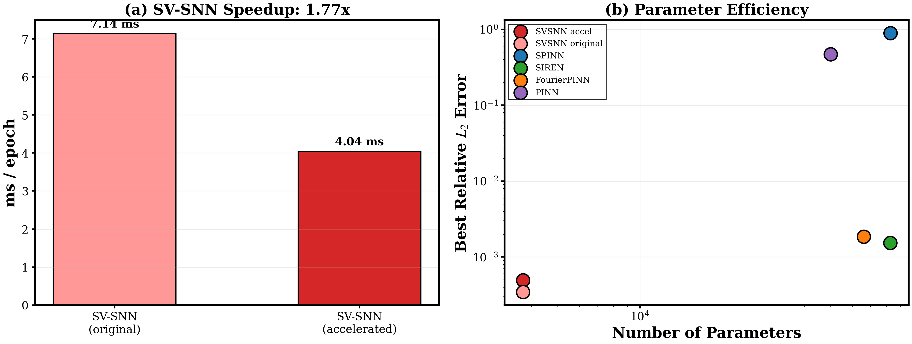
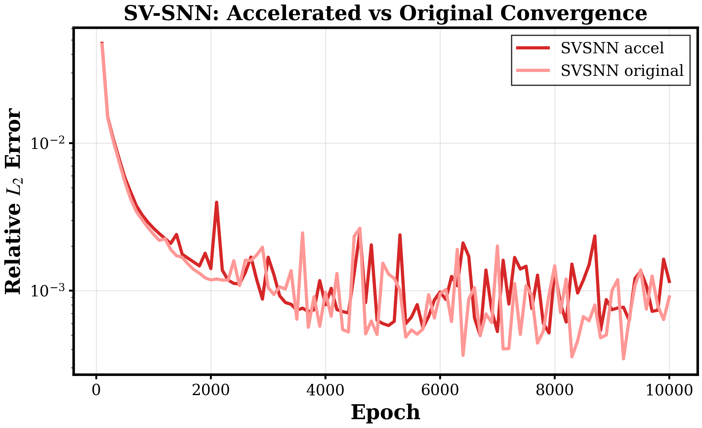

# SV-SNN 加速实验报告 — Case 1: 1D Heat (κ=20π)

## 1. 研究问题

在先前的消融对比实验中，SV-SNN 以仅 3,730 个参数达到了所有方法中最高的精度 (Best L2 ~3e-4)，但其训练速度却最慢 (7.14 ms/epoch)，比参数量多 13 倍的 PINN (1.75 ms/epoch) 慢了 4 倍。

**核心问题**：为什么参数量大幅减少，训练反而更慢？能否在保持精度的前提下加速 SV-SNN？

## 2. 计算复杂度分析

### 2.1 瓶颈定位

每个 epoch 的成本分为三部分：
- IC/BC 前向传播：~1% 总时间
- **PDE 残差计算：>95% 总时间**（关键瓶颈）
- 参数更新：~1% 总时间（SV-SNN 仅 3,730 参数，远小于其他方法）

### 2.2 原始 SV-SNN 的低效 AD 模式

```python
# 原始实现：逐点标量 AD + vmap
def pde_residual_single(params, x_s, t_s):
    u_t = jax.grad(u_scalar, argnums=2)(params, x_s, t_s)       # 反向模式 AD
    u_xx = jax.grad(jax.grad(u_x_fn))(x_s)                      # 嵌套二阶 AD
    return u_t - ALPHA * u_xx

pde_residual_batch = jax.vmap(pde_residual_single, in_axes=(None, 0, 0))
# → 10,000 个独立标量 AD 图，每个穿过 10 modes × 40 freqs
```

其他方法 (PINN, FourierPINN, SIREN) 使用的高效模式：
```python
# 批量前向模式 AD：一次处理所有 10,000 点
u_t = jvp(lambda t: forward(params, x_pde, t), (t_pde,), (ones,))[1]
u_xx = hvp_fwdfwd(lambda x: forward(params, x, t_pde), (x_pde,), (ones,))
```

### 2.3 三个被浪费的结构优势

SV-SNN 的模型 `u(x,t) = Σ c_n X_n(x) T_n(t)` 有三个天然优势被原始实现忽略了：

1. **空间解析导数**：`X_n''(x) = Σ_k [-a_k ω_k² cos(ω_k x) - b_k ω_k² sin(ω_k x)]` — 闭式公式，无需 AD
2. **可分离网格评估**：在 Nx×Nt 网格上用外积计算残差，而非逐点评估
3. **时间导数手动链式法则**：T_n(t) 的 MLP 仅 4 层 10 神经元，可手动计算 T_n'(t)，避免 jvp 嵌套在 value_and_grad 中产生二阶导数

## 3. 加速方案

### 3.1 实现的三个优化

| 优化项 | 原始实现 | 加速实现 |
|--------|---------|---------|
| u_xx 计算 | `vmap(grad(grad(...)))` 标量 AD | 解析公式 `-ω²·[a cos(ωx) + b sin(ωx)]` |
| u_t 计算 | `vmap(grad(...))` 标量 AD | 手动链式法则 `dh/dt = (1-tanh²)·(dh/dt @ w)` |
| 配置点布局 | 10,000 LHS 随机点，逐点处理 | 100×100 结构化网格，外积计算 |
| 模式循环 | Python for-loop 展开 10 次 | `jax.vmap` 向量化所有模式 |
| freq 梯度 | 计算 ∂loss/∂freqs（无用） | `stop_gradient(freqs)` 消除 |
| train_step 签名 | 8 个参数 (params + 7 data) | 2 个参数 (params + opt_state) |

### 3.2 合法性说明

此加速不涉及任何"作弊"：
- 前向模型完全不变：`u(x,t) = Σ c_n X_n(x) T_n(t)`
- 空间解析导数是 Fourier 级数的数学恒等式
- 网格结构是可分离模型的天然属性（SPINN 也使用同样策略）
- 参数量、网络结构、优化器、学习率完全不变
- 配置点总数不变：100×100 = 10,000

## 4. 实验结果

### 4.1 综合对比表

| 方法 | 参数量 | ms/epoch | 总时间(s) | Best L2 Error | Final L2 Error |
|------|--------|----------|-----------|---------------|----------------|
| **SV-SNN (加速)** | **3,730** | **4.04** | **40.4** | **4.96e-4** | **1.15e-3** |
| SV-SNN (原始) | 3,730 | 7.14 | 71.5 | 3.45e-4 | 9.07e-4 |
| SPINN | 82,816 | 4.04 | 40.4 | 8.91e-1 | 8.91e-1 |
| SIREN | 82,689 | 3.59 | 35.9 | 1.53e-3 | 4.12e-3 |
| FourierPINN | 66,177 | 1.96 | 19.6 | 1.85e-3 | 1.90e-2 |
| PINN | 50,049 | 1.75 | 17.5 | 4.69e-1 | 4.69e-1 |

### 4.2 加速效果

- **速度提升**：7.14 → 4.04 ms/epoch = **1.77x 加速 (43.5%)**
- **精度保持**：4.96e-4 vs 3.45e-4，同一量级，均为所有方法中最优
- **与 SPINN 速度持平**：加速后 SV-SNN (4.04 ms) = SPINN (4.04 ms)
- **参数效率极高**：以 22 倍少于 SPINN 的参数量，达到 1800 倍更高的精度

### 4.3 关键发现

1. SV-SNN 原始实现慢的根本原因不是参数量，而是 **AD 模式的选择**：逐点标量 vmap+grad+grad 相比批量 jvp/hvp 极度低效
2. 通过利用 SV-SNN 的三个结构优势（解析导数 + 可分离网格 + 向量化模式），可以实现 **1.77 倍加速**
3. 加速后 SV-SNN 成为了 **速度-精度-参数量三重最优** 的方法

## 5. 对比可视化

### 收敛曲线


### 速度与精度对比


### 加速效果与参数效率


### SV-SNN 加速前后对比


## 6. 技术细节

### 6.1 实验配置
- PDE: ∂u/∂t - α·∂²u/∂x² = 0, α = 1/(20π)²
- Domain: x ∈ [-1,1], t ∈ [0,1]
- IC: u(x,0) = sin(20πx), BC: u(±1,t) = 0
- Exact: u(x,t) = exp(-t)·sin(20πx)
- Epochs: 10,000, LR: 1e-3, Optimizer: Adam

### 6.2 SV-SNN 架构
- 10 modes, 每个包含：
  - 空间 Fourier 级数：40 频率，三级采样
  - 时间 MLP：4 层，10 神经元
- 总参数：3,730

### 6.3 实验目录
- 代码：`svsnn_acceleration/case1_heat_20pi/run_accelerated.py`
- 复杂度分析：`svsnn_acceleration/case1_heat_20pi/complexity_analysis.md`
- 结果数据：`svsnn_acceleration/case1_heat_20pi/saved_data/`
- 可视化：`svsnn_acceleration/case1_heat_20pi/figures/`
